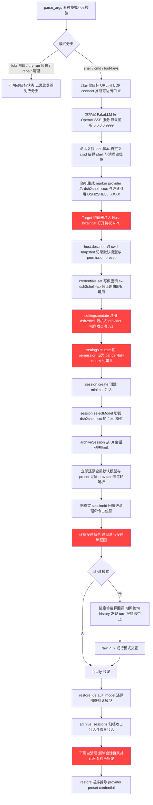
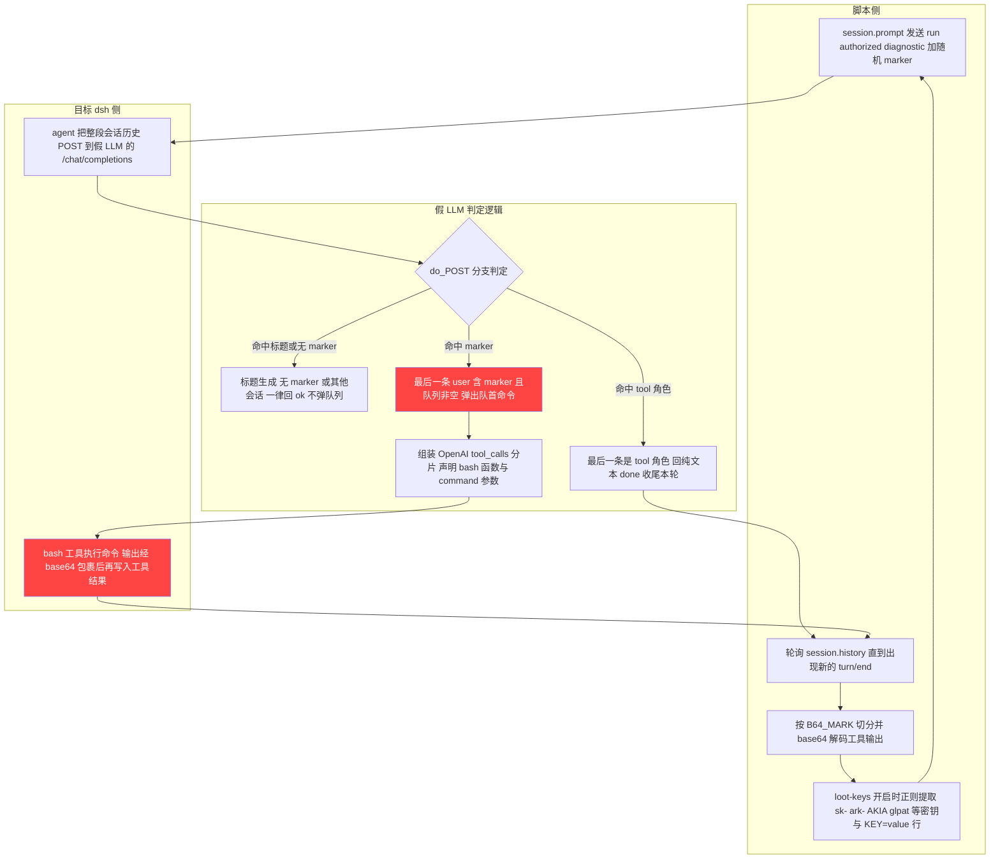
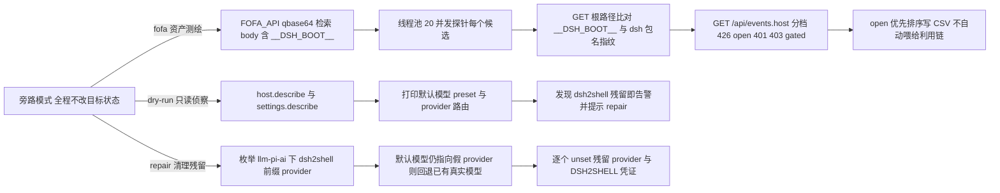
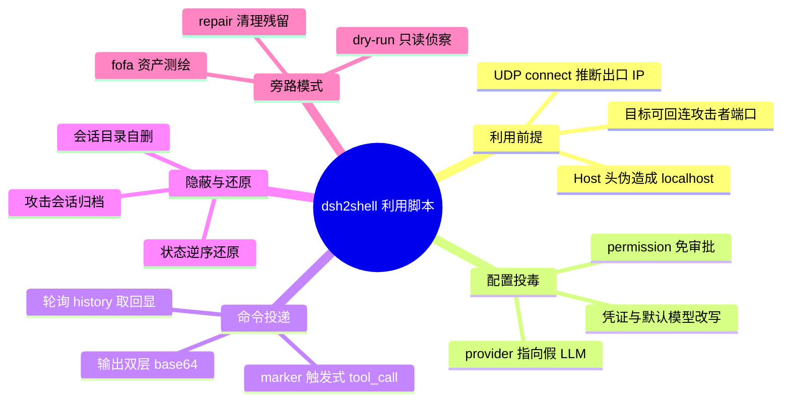

# 说明

分析对象为 GitHub 仓库 ChaoMixian/dsh2shell（仓库自称针对暴露在公网的 DeepSeek Harness web 实例的未认证 RCE 利用脚本，声明仅限授权测试）。仓库只有一个 Python 脚本 dsh2shell.py，纯标准库实现。以下内容基于该脚本静态阅读，未对任何目标执行。

脚本没有第三方外联地址，唯一的外部 API 是 FOFA 官方检索接口；回连地址由使用者通过 --public-base 与 --lhost 显式指定，默认取本机到目标的出口 IP。脚本本身不含隐藏回传。

# 原理

脚本不去猜 API key，也不依赖目标上有可用的真实模型。它伪造 Host 头让请求看起来来自本机，从而调用 dsh 的特权 RPC；再用特权 RPC 注册一个临时模型服务商，把地址指向自己起的假 OpenAI 服务；随后新建会话并把模型切到该服务商，向会话发一条带随机标记的提示词。目标侧的 agent 循环会把整段会话历史发到假服务端，假服务端只回一个 bash 工具调用，命令内容由脚本预先排队。执行结果随会话历史回读，整条链路不出现真实密钥。

# 主利用链

入口按互斥模式分流。shell、cmd、loot-keys 三种走同一条主链，另外三种是旁路模式。

前置准备阶段：规范化目标 URL 后，用 UDP connect 推断本机到达目标所用的出口 IP 作为默认回调地址；拉起 FakeLLM 服务（默认监听 0.0.0.0:9999）；把待执行的命令按序排进队列，顺序是 loot 脚本、各条 --cmd、反弹 shell 命令，末尾追加一个清理占位符；随机生成三个值用于给攻击产物打标，分别是提示词标记 marker、服务商名 dsh2shell-xxxx、凭证引用 DSH2SHELL_XXXX。

目标侧配置阶段，每一步都是对目标的写操作：Target 构造器在目标主机名不是回环地址时，把 Host 头写成 localhost，特权 RPC 就此打开；host.describe 取当前工作目录，同时快照默认模型与 permission preset 供收尾还原；credentials.set 先写入假密钥，保证后续注册的服务商在发布瞬间就是可用的；settings.mutate 在 llm-pi-ai 命名空间下注册指向攻击者 /v1 的 provider；settings.mutate 把 permission 的 defaultPreset 改成 danger-full-access，之后的工具调用不再走审批；session.create 建一个 minimal 会话；session.selectModel 把该会话切到 dsh2shell 的 fake 模型，这一步还会顺带把部署默认模型持久化，脚本随后立即把默认模型和 preset 改回原值，只保留 provider 与凭证存活到最后一轮命令，因为每一轮都要重新解析它们；archiveSession 把攻击会话从 UI 会话列表隐藏，但会话仍可继续接收提示词。

命令投递阶段见下节。shell 模式下脚本还会阻塞等待反弹回调，等待期间轮询会话历史，一旦发现 turn 结束于错误就提前中止。

收尾放在 finally 里，顺序有依赖：先还原部署默认模型，再归档攻击会话与修复会话，然后下发自清理命令删除会话目录（另起一个后台任务在 6 秒后再扫一遍，用于清理本轮命令自身产生的尾部事件），最后逆序拆除 provider、preset、凭证；任何一步失败都会重试三次，仍失败则打印具体的手工修复指令。--no-cleanup 会整段跳过。

## 主利用链流程图

# 命令投递

假服务端不是无条件地把命令吐出来。判定在 do_POST 里按三条分支走，顺序敏感：

| 判定条件 | 返回 | 目的 |
|---|---|---|
| 最后一条消息角色是 tool | 纯文本 done | 结束本轮，让 turn 收尾 |
| 请求体的 messages 里含 concise title 或 Generate the session title | 纯文本 ok | 会话标题生成请求不占用命令队列 |
| 最后一条 user 消息含 marker 且队列非空 | bash 工具调用 | 弹出队首命令交给目标执行 |
| 其余 | 纯文本 ok | 历史回放、其他用户会话一律不受影响 |

marker 只在最后一条 user 消息里计数，这一点是整条链路稳定性的关键：因为 selectModel 已经把部署默认模型改成假服务商，目标上其他用户的会话也会打到这个假服务端，它们必须拿到一个无害回复；即便拿不到，也不会误弹队列。

命中 marker 时返回的是一段 OpenAI 流式响应，先把 tool_calls 分片声明成函数名 bash、参数为空，再补一个分片给出 command 参数，最后以 tool_calls 作为结束原因并附上 usage 字段，末尾补 data: [DONE]。目标执行完命令后会把工具结果再次发来，此时走到第一条分支，返回 done 结束该轮。

脚本侧不解析流式响应，而是轮询 session.history 数 turn/end 事件个数，比开跑前多出一条才算本轮结束，避免把上一轮的历史当成新结果。取回的工具输出先按标记 B64_MARK 切分再 base64 解码。开启 --loot-keys 时，会对解码后的文本跑两轮正则，一轮抓 sk-、ark-、nvapi-、ghp_、glpat-、AKIA 等固定前缀的令牌，另一轮抓整行的 KEY、TOKEN、SECRET、PASSWORD 赋值，抓到的值回显在终端上。

两个细节值得单独记：命令在下发前用 base64 编码再交给 bash 执行，这样审批规则里针对 rm -rf 这类破坏性模式的匹配看不到原文，而没有客户端接入时被强制触发的审批会自动拒绝该次工具调用，编码同时绕开了这两种拦截；工具输出同样先 base64 一次再回传，让扫描工具结果里密钥特征的防护插件（脚本注释点了 dsh-defend）看不到明文。

## 命令投递流程图

# 旁路模式

fofa 模式只做资产盘点：以 body 含 __DSH_BOOT__ 为条件检索，对每个候选先看根路径指纹，再看 /api/events.host 的响应码，426 记为 open、401 或 403 记为 gated、其余记为 uncertain，按 open 优先排序写入 CSV。脚本注释明确写了 FOFA 结果不会自动喂给利用链，需要人工指定 -t。

dry-run 只读侦察：调 host.describe 与 settings.describe，打印默认模型、permission preset、provider 路由，并检查有没有 dsh2shell 前缀的残留。

repair 用于收拾被中断的运行：枚举 llm-pi-ai 下的残留 provider，若默认模型仍指向假服务商则回退到目标已有的真实模型（没有用户路由时回退到内置的 deepseek-official），最后逐个删除残留 provider 与对应的 DSH2SHELL 凭证。

## 旁路模式流程图

# 机制总览

# 防御视角

按利用链顺序，每一环都有对应收敛点。

Host 头是整条链的第一个门。特权 RPC 的可见性判定如果取请求里的 Host 值，攻击者改一个头就能拿到本机身份；判定应取连接的对端地址，并且特权接口需要独立令牌，不能只靠来源地址。

自定义模型服务商允许把 baseURL 指向任意地址，等于把 agent 的工具执行能力交给了任意第三方服务端。dsh 当前默认模型可被会话级操作持久化为部署默认值，这会把其他用户会话一并导流到攻击者的服务端，影响面从单个会话扩散到整个部署。服务商配置应限制为管理员操作，出站地址需要白名单，并且禁止通过会话级接口改写部署默认值。

permission 的 defaultPreset 能被配置客户端改成 danger-full-access，工具调用审批就此失效，且不依赖任何客户端接入。审批开关需要与配置写入权限分离。

凭证与模型的写入没有任何鉴权前置，credentials.set 可以直接写入任意引用名。凭据接口应只允许写入，不允许读取回显，且需要与 provider 配置解耦。

清理阶段暴露了对抗检测的取向：破坏性命令与密钥回传都做了 base64 处理以避开审批规则与结果扫描。检测侧对工具调用参数与工具结果做解码后再匹配，可以覆盖这一层。

# 参考

- 仓库地址：https://github.com/ChaoMixian/dsh2shell
- 脚本文件：dsh2shell.py
